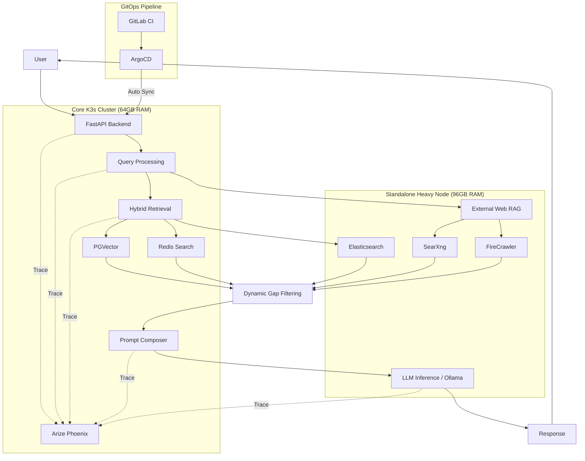

# Core-X

> 실서비스 수준 운영을 목표로 구축한 **RAG 기반 AI Assistant Backend**
> 하이브리드 검색, 검색 품질 개선, 토큰 비용 최적화, 관찰성 기반 개선, GitOps 배포 경험을 담은 프로젝트

---

## 1. Overview

Core-X는 대화형 AI Assistant를 위한 **RAG(Retrieval-Augmented Generation) 백엔드 시스템**입니다.
단순히 LLM 호출만 수행하는 데모 프로젝트가 아니라, 실제 사용 환경을 고려하여 다음 요소를 중심으로 설계했습니다.

- **하이브리드 검색 기반의 문서 검색 품질 개선**
- **동적 Gap Filtering을 통한 검색 노이즈 감소**
- **프롬프트 구조 개선을 통한 토큰 비용 최적화**
- **Phoenix 기반 관찰성(Observability)으로 응답 품질 추적**
- **온프레미스 K3s + GitLab CI + ArgoCD 기반 GitOps 배포**

현재는 개인 운영 환경에 배포하여 실제로 사용하면서 품질을 지속적으로 개선하고 있습니다.

---

## 2. Why Core-X

LLM 애플리케이션은 단순히 모델을 호출하는 것만으로는 실사용 품질을 확보하기 어렵습니다.
Core-X는 아래와 같은 문제를 해결하기 위해 만들어졌습니다.

### 해결하고자 한 문제
- 벡터 검색만 사용할 경우 발생하는 **검색 누락 / 의미적 오탐**
- 키워드 검색만 사용할 경우 발생하는 **문맥 이해 부족**
- 불필요한 문서 주입으로 인한 **응답 품질 저하 및 토큰 비용 증가**
- 운영 이후 문제를 추적하기 어려운 **블랙박스형 LLM 파이프라인**
- 로컬/수동 중심 배포 방식의 **느린 운영 사이클**

### 접근 방식
- **PGVector + Elasticsearch(+ Redis Search 활용 가능 구조)** 기반 하이브리드 검색
- 검색 결과에 대한 **동적 Gap Filtering**
- 한글 지시문을 **영문 구조화 프롬프트**로 변환하여 토큰 효율 개선
- **Arize Phoenix** 기반 추적/평가
- **GitOps 배포 자동화**로 운영 생산성 향상

---

## 3. Key Features

### 1) Hybrid Retrieval + Reranking
- **PGVector** 기반 dense retrieval
- **Elasticsearch** 기반 keyword / BM25 retrieval
- 1차 검색 결과를 결합한 뒤 reranker를 적용해 최종 문맥 후보를 정제
- 검색 목적에 따라 각 검색 결과를 조합해 더 안정적인 retrieval 수행

### 2) Dynamic Gap Filtering
- 상위 검색 결과 간 score gap 및 **최소 유사도 점수(0.1)**를 기준으로 
의미적으로 관련성이 낮은 문서를 동적 절삭(Drop).
- 불필요한 context 주입을 줄여 응답 정확도 개선

### 3) Prompt Optimization
- 한글 자연어 지시문을 그대로 사용하는 대신,
- 내부적으로 **영문 구조화 프롬프트**를 사용해 토큰 사용량 최적화
- 실험 기준 **약 17% 토큰 절감**
- 내부 테스트 기준 JSON 포맷 등 **지시 준수율 90% 수준 달성**

### 4) External Web RAG
- 내부 데이터만으로 답변하기 어려운 경우를 대비해
**SearXng**, **FireCrawler** 등을 활용해 외부 정보 수집 및 웹 기반 보강 검색 지원

### 5) Observability for LLM Apps
- **Arize Phoenix**를 활용해
  - 요청 흐름 추적
  - retrieval 결과 확인
  - prompt / response 분석
  - 품질 개선 포인트 식별

### 6) Production-Oriented Deployment
- 온프레미스 **K3s** 환경에서 운영
- **GitLab CI + ArgoCD** 기반 GitOps 배포
- 배포 시간 **20분 → 3분 단축**

---

## 4. Tech Stack

### Backend
- Python
- FastAPI

### Retrieval / Search
- PGVector
- Elasticsearch
- Redis Search

### External RAG / Crawling
- SearXng
- FireCrawler

### Observability
- Arize Phoenix

### Infra / DevOps
- K3s
- GitLab CI
- ArgoCD
- GitOps

---

## 5. Architecture

### High-Level Flow
1. 사용자의 질문을 수신
2. 질문 유형에 따라 내부 문서 검색 또는 외부 검색 수행
3. PGVector / Elasticsearch 기반 하이브리드 검색 수행
4. 검색 결과에 대해 Gap Filtering 적용
5. 정제된 컨텍스트를 기반으로 프롬프트 구성
6. LLM 응답 생성
7. Phoenix로 trace 및 품질 확인
8. 운영 환경(K3s)에서 GitOps로 지속 배포

---

## 6. Architecture Diagram



---

## 7. Project Highlights

### 검색 품질 개선
- dense retrieval과 keyword retrieval을 함께 사용하여
  단일 검색 방식의 한계를 보완

### 노이즈 감소
- Gap Filtering으로 관련성이 낮은 문서를 제거해
  context 오염 최소화

### 비용 최적화
- 프롬프트 구조 개선으로
  **약 17% 토큰 절감**

### 운영 자동화
- GitOps 기반 배포 자동화로
  **배포 시간 20분 → 3분 단축**

### 실사용 검증
- 개인 운영 환경에서 실제 사용하며
  지속적으로 개선 중인 실서비스 지향 프로젝트

---

## 8. Example Use Cases

- 개인 AI Assistant 백엔드
- 사내 문서 검색형 Q&A 시스템
- 웹 검색 결합형 RAG 서비스
- 관찰성과 운영 자동화를 포함한 LLM 서비스 백엔드 실험/확장 기반

---

## 9. Running Locally

> 아래 명령은 예시입니다. 실제 프로젝트 구조에 맞게 수정하세요.  
> 전체 기능 실행을 위해서는 PostgreSQL(PGVector), Elasticsearch, Redis, Phoenix, SearXng 등 관련 서비스가 사전 구성되어 있어야 합니다.

### Backend
```bash
git clone https://github.com/your-id/core-x.git
cd core-x

python -m venv .venv
source .venv/bin/activate

pip install -r requirements.txt
uvicorn app.main:app --reload
```

### Environment Variables
```bash
OPENAI_API_KEY=your_api_key
DATABASE_URL=your_database_url
ELASTICSEARCH_URL=your_elasticsearch_url
REDIS_URL=your_redis_url
SEARXNG_URL=your_searxng_url
FIRECRAWLER_API_KEY=your_firecrawler_key
PHOENIX_ENDPOINT=your_phoenix_endpoint
```

---

## 10. Deployment

Core-X는 온프레미스 환경의 **K3s 클러스터**에 배포되며,
**GitLab CI → ArgoCD → K3s** 흐름의 GitOps 방식으로 운영됩니다.

### Deployment Flow
1. GitLab에 코드 푸시
2. GitLab CI에서 이미지 빌드 및 배포 매니페스트 갱신
3. ArgoCD가 변경 사항을 감지
4. K3s 클러스터에 자동 반영

이 과정을 통해 수동 배포 의존도를 줄이고,
더 빠르고 일관된 운영 사이클을 확보했습니다.

---

## 11. Observability

LLM 애플리케이션은 “왜 이런 답변이 나왔는지” 추적할 수 있어야 합니다.
Core-X는 **Arize Phoenix**를 활용해 아래 항목을 추적합니다.

- 어떤 query가 들어왔는지
- 어떤 문서가 retrieval 되었는지
- 어떤 prompt가 생성되었는지
- 응답 품질이 어떤지
- 개선이 필요한 병목이 어디인지

이를 통해 단순 기능 구현을 넘어
**운영 가능한 AI 시스템**으로 발전시키는 것을 목표로 했습니다.

---

## 12. What I Learned

이 프로젝트를 통해 다음을 경험했습니다.

- RAG 시스템에서 retrieval 품질이 응답 품질을 크게 좌우한다는 점
- 검색 결과를 무조건 많이 넣는 것이 아니라,
  **잘 거르는 전략**이 중요하다는 점
- 프롬프트 설계가 비용과 품질 모두에 직접적인 영향을 준다는 점
- LLM 서비스는 observability 없이는 개선 속도가 매우 느리다는 점
- 배포 자동화와 운영 안정성이 프로젝트 완성도를 크게 높인다는 점

---

## 13. Future Improvements

- query routing 고도화
- 세션/사용자별 메모리 관리 강화
- 평가셋 기반 자동 품질 측정 파이프라인 구축
- 멀티 에이전트 구조 실험
- 비용/지연시간 최적화 고도화

---

## 14. Repository Structure

```bash
core-x/
├── .venv/
├── services/
│   └── reranker/
│       └── reranker_server.py
├── src/
│   ├── app/
│   │   ├── api/
│   │   │   └── __init__.py
│   │   ├── core/
│   │   │   ├── __init__.py
│   │   │   ├── database.py
│   │   │   ├── db.py
│   │   │   └── tools.py
│   │   ├── models/
│   │   │   ├── __init__.py
│   │   │   ├── models.py
│   │   │   └── redis_model.py
│   │   ├── service/
│   │   │   ├── __init__.py
│   │   │   ├── chat_service.py
│   │   │   ├── chat_to_es_service.py
│   │   │   ├── llm.py
│   │   │   ├── rag_service.py
│   │   │   ├── redis_service.py
│   │   │   └── report_service.py
│   │   ├── __init__.py
│   │   └── main.py
│   └── __init__.py
├── .dockerignore
├── .env
├── .gitignore
├── .gitlab-ci.yml
├── Dockerfile
├── README.md
└── requirements.txt
```

---

## 15. Summary

Core-X는 단순한 LLM 데모가 아니라,
**검색 품질 개선, 비용 최적화, 관찰성, 배포 자동화**를 함께 다룬
**실서비스 지향 RAG 백엔드 프로젝트**입니다.

이 프로젝트를 통해
AI 애플리케이션을 “만드는 것”을 넘어
**운영하고 개선하는 경험**까지 확장하고자 했습니다.